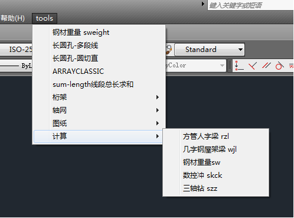

# 介绍
保存了我这些年写的一些工作上使用的AutoCad 的 lisp 程序。

有些程序引用了特定的图块，所以直接运行会报错。

仅供参考。

# 目录
- batchplot.LSP  目前使用的程序。默认使用 HP M701打印机
- batchplot-M1213nf.LSP    在HP M1213上自动批量打印, 需把图框设定为特
  定块名.
- batchplot-pdf.LSP    自动打印为pdf文件. 不过还有bug.
- ccyk.lsp    长圆孔-多段线（类似solidworks中的槽口）
- copy-layout.lsp  复制布局
- cyk.lsp    长圆孔-圆切直 （以长轴为直径画圆，然后作两平行玄，距离是短轴尺寸）
- drawing-number.LSP   对标题栏图快进行图号编辑
- fugan.LSP  快速简易画桁架的腹杆
- hengjia.LSP  快速简易画桁架（除腹杆以外）
- itoc(数字转换成汉字).lsp   将数字 ‘0～9’ 转为汉字 ‘零～九’
- lname.LSP    在布局空间，获取标题栏图名， 赋值给布局选项卡名
- osmode.LSP 快速恢复对象捕获设置
- plot-M701.lsp
- plot-monochrome.lsp
- plot-pdf.lsp
- rzl.lsp   计算人字梁长度
- skck.LSP   由CAD图纸手工生成数控冲床加工代码
- skck-mirror.LSP  由CAD图纸手工生成数控冲床加工代码， 镜像对称时用
- steel.dcl     sweight.LSP的DCL文件
- steelweight-reg6.LSP   计算几种型钢重量， 利用了正则表达式实现对输入语句的合法性校验
- swr.VLX   steelweight-reg6.LSP编译过的二进制文件
- sum-length.lsp   计算选中的线段总长度
- sweight.LSP   计算三种钢材重量 使用DCL对话框
- szz.LSP   由CAD图纸手工生成数控三轴钻钻孔CNC代码
- tu-fu-kuang-new-a4block.lsp   给定对角线两点，生成A4、A3图框，自动设置字体和标注比例
- venlo-p.dcl     venlo-plan-dcl.LSP  的DCL文件
- venlo-plan-dcl.LSP  由给定参数，生成温室轴网
- wjl.lsp  根据屋脊跨度，几字钢屋架长度计算
- xuhaoqiu-r.lsp  生成序号球，自定义编号起始号码
- zw.LSP  根据给定参数，生成轴网
